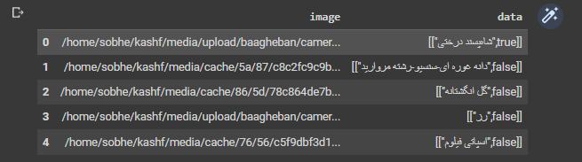
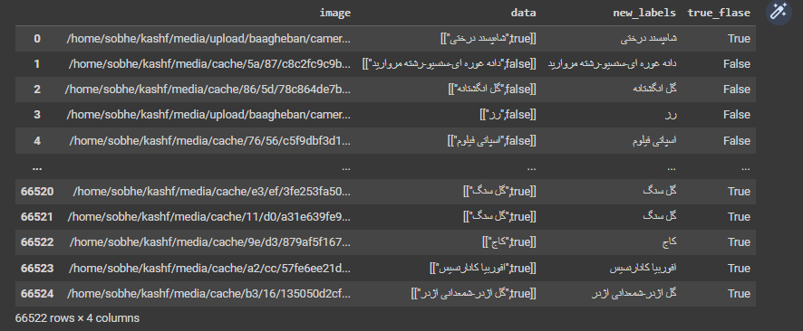

in this project, I tried to train a network on a real dataset of flowers. the Dataframe had the following shape at first:

# preprocessing of Dataframe and dataset


 by using the following function, I managed to extract the ```True / False``` and the name of the flower:

 ```
 def extract_string(x):
    
    if pd.isna(x):
        return None
    
    x = str(x)
    my_list = json.loads(x)
    
    result = my_list[0][0].encode('utf-8', "ignore").decode('utf-8')
    return result
 ```

 ```
 def extract_true_flase(x):
    
    if pd.isna(x):
        return None
    
    x = str(x)
    my_list = json.loads(x)
    
    result = my_list[0][1]
    return result
 ```

 ```
 def extract_image_name(x):
  x = str(x)
  name = x.split('/')[-1]
  return name
 ```

after that I applied the following function on my dataframe:
 ```
df['new_labels'] = df['data'].apply(extract_string)
df['true_flase'] = df['data'].apply(extract_true_flase)
 ```
 since there are some ```NaN``` elements in our dataset, I deleted those rows using the following code:
 ```
df = df.dropna(subset=['new_labels', 'true_flase'])
final_df = df.copy()
 ```
 here is the final dataframe:

 

 since some image names have the format ```.png``` or ```.jpeg``` , I wrote the following rejex code to change them into ```.jpg```:
 ```
 df['image']      = df['image'].str.replace(r'\.\w+$', '.jpg', regex=True)
 ```

 since there are some irrelative images among the dataset, and since most of them are images of face, I used the following code to detect those non-flower images:

 ```
import os
import cv2
import dlib
from tqdm.notebook import tqdm

image_folder = "/content/roshan_internship_full_dataset_cleaned"
detector = dlib.get_frontal_face_detector()
bad_images = []
for filename in tqdm(os.listdir(image_folder)):
    if filename.endswith('.jpg'):
        image_path = os.path.join(image_folder, filename)
        image = cv2.imread(image_path)
        gray = cv2.cvtColor(image, cv2.COLOR_BGR2GRAY)
        faces = detector(gray)
        if faces:
            bad_images.append(filename)
 ```

 for now we just extracted some irrelative images, latter we will delete those irrelative images that have ```True``` label.

 here are some of the irrelative images:


after that we need to delete some rows in our Dataframe, such as rows that have a image name which is not in the data set. to do that I used the following code:
```
# Drop the row if its name is not in the available names
final_df = final_df[final_df['image_name'].isin(available_images)]
final_df.reset_index(drop=True, inplace=True)
```

since some flower classes have low amount of images, I deleted the classes that contain less than ```200``` images using the following code:

```
# Delete rows with less than 20 image
final_df = final_df.groupby('new_labels').filter(lambda x: True if len(x) >= 200 else False)
final_df.reset_index(drop=True, inplace=True)
```

Now we are going to use that ```bad_images``` list which contains some of the irrelative images. I deleted those irrelative images that have ```True``` label using the following code:
```
final_df = final_df[~((final_df['true_flase'] == True) & (final_df['image_name'].isin(bad_images)))]
```

Now by using ```pd.get_dummies``` we can see that we have ```130``` classes:

# Data loader and Data augmentation

since I use ```PyTorch``` frame work, I wrote the following dataloader for this dataset:

```
class CustomDataset(data.Dataset):
  def __init__(self, root ,data_frame, transform):
    self.root = root
    self.data_frame = data_frame.reset_index(drop=True)
    self.input_transform = transform

    print(f'{len(self.data_frame)} Images found')

  def __getitem__(self,idx):
    image_path = os.path.join(self.root, self.data_frame['image_name'][idx])
    pil_img = Image.open(image_path)
    img = self.input_transform(pil_img)
    label = np.argmax(np.array(pd.get_dummies(self.data_frame['new_labels']).loc[idx]))
    
    true_flase = self.data_frame['true_flase'][idx]
    return img, label, true_flase

  def __len__(self):
    return len(self.data_frame)
```

and I used the ```torchvision``` library to augment the data using the following transforms:
```
transform_train = transforms.Compose([
          transforms.RandomApply(
            torch.nn.ModuleList([
              transforms.RandomRotation(degrees= 10),
              transforms.RandomHorizontalFlip(),
              transforms.RandomVerticalFlip(),
          ])),
          transforms.Resize((IMAGE_SIZE,IMAGE_SIZE)),
          transforms.ToTensor(),
          transforms.Normalize((0.4914, 0.4822, 0.4465), (0.2023, 0.1994, 0.2010)),
          transforms.Lambda(lambda x: torch.clamp(x, 0, 1)), 
])

transform_test = transforms.Compose([
    transforms.ToTensor(),
    transforms.Resize((IMAGE_SIZE,IMAGE_SIZE)),
    transforms.Normalize((0.4914, 0.4822, 0.4465), (0.2023, 0.1994, 0.2010)),
    transforms.Lambda(lambda x: torch.clamp(x, 0, 1)), 
])
```

# Neural Network
to train a model on this dataset, I used a net work with ```ResNet152``` backbone and I added some other layers to customize the network:

```
class convnet(nn.Module):
    def __init__(self,num_class):
        super(convnet,self).__init__()
        self.base = models.resnet152(pretrained=True)
        self.base.fc = nn.Linear(in_features=2048, out_features=1000, bias=True)

        self.block = nn.Sequential(
            
         nn.Dropout(0.5),
         nn.Linear(in_features=1000, out_features=512, bias=True),
         nn.Dropout(0.5),
         nn.SELU(),
         nn.Linear(in_features=512, out_features=64, bias=True),
         nn.Dropout(0.4),
         nn.SELU(),
         nn.Linear(in_features=64, out_features=num_class, bias=True),
        )
    
    def forward(self,x):
        x = self.base(x)
        x = self.block(x)
        return x
```

# loss function
since here we need to consider ```True / False``` label and the class of a flower, we need write a custom loss function, I decided to give the coefficient 0.5 in case that our network predicted a class as ```False```. If we consider a large coefficient may be our loss becomes extremely large and it causes a bad training.
```
import torch.nn.functional as F
class CustomLoss(nn.Module):
    def __init__(self):
        super(CustomLoss, self).__init__()

    def forward(self, outputs, targets, true_false):
        """
        outputs: tensor of shape (batch_size, num_classes)
        targets: tensor of shape (batch_size,)
        true_false: tensor of shape (batch_size,) containing boolean values
        """
        # keep only the rows where true_false is True
        mask = true_false.bool()
        outputs = outputs[mask]
        targets = targets[mask]

        # calculate cross-entropy loss for the remaining rows
        loss = F.cross_entropy(outputs, targets)

        return loss
```
# Results
the results of training are as below:
 <table>
<thead>
	<tr>
		<th>Network</th>
		<th>epochs</th>
        <th>Batch Size</th>
        <th>Image Size</th>
        <th>Train Accuracy</th>
        <th>Val Accuracy</th>
        <th>Train Loss</th>
        <th>Val Loss</th>
	</tr>
</thead>
<tbody>
	<tr>
		<td>ResNet152</td>
		<td>50</td>
        <td>32</td>
        <td>150x150</td>
        <td>0.69</td>
        <td>0.68</td>
        <td>1.9</td>
        <td>2.01</td>
	</tr>

</tbody>
</table>


# Future works

there are some suggestion to improve the accuracy of model
- using ```apex``` library to convert the model to ```float16```. it will alow us to increase batch size or image size

- finding the suitable learning rate and changing hyper parameters of the model may alow us to increase the accuracy.

- using accumulative gradient can be a helpful suggestion to improve the model's accuracy.
